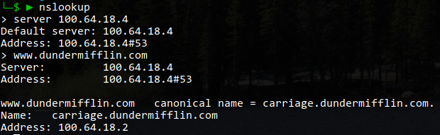

### Machines B and F (carriage and saddle):

I ran the following commands, given that ssh is port 22, http is port 80, and https is port 443.

```
# Allow all loopback traffic
iptables -A INPUT -i lo -j ACCEPT
iptables -A OUTPUT -o lo -j ACCEPT

# Stateful!
iptables -A INPUT -m conntrack --ctstate ESTABLISHED,RELATED -j ACCEPT
iptables -A OUTPUT -m conntrack --ctstate ESTABLISHED -j ACCEPT

# Ping/tracert rules
iptables -A INPUT -p icmp --icmp-type echo-request -j ACCEPT
iptables -A INPUT -p icmp --icmp-type echo-reply -j ACCEPT
iptables -A INPUT -p icmp --icmp-type time-exceeded -j ACCEPT
iptables -A INPUT -p icmp --icmp-type destination-unreachable -j ACCEPT

# Default to drop
iptables -P INPUT DROP
# No forwards
iptables -P FORWARD DROP
sysctl -w net.ipv4.ip_forward=0

# SSH Rules
iptables -A INPUT -p tcp -s 100.64.0.0/16 --dport 22 -m conntrack --ctstate NEW,ESTABLISHED -j ACCEPT
iptables -A INPUT -p tcp -s 10.21.32.0/24 --dport 22 -m conntrack --ctstate NEW,ESTABLISHED -j ACCEPT
iptables -A INPUT -p tcp -s 198.18.0.0/16 --dport 22 -m conntrack --ctstate NEW,ESTABLISHED -j ACCEPT

# Allow http/https traffic
iptables -A INPUT -p tcp --dport 80 -m conntrack --ctstate NEW,ESTABLISHED -j ACCEPT
iptables -A INPUT -p tcp --dport 443 -m conntrack --ctstate NEW,ESTABLISHED -j ACCEPT

# Save it
service iptables save
```

On saddle, I also had to add:

```
systemctl stop firewalld
systemctl disable firewalld
systemctl enable iptables
systemctl start iptables
```

After rebooting, rules were verified with `iptables -v -L` on each machine and `nmap 100.64.18.{2, 5}` run locally (outside the network).


And with proper nameservers set while VPN'd in:

### 

### Machine D (chase):

Machine D was very similar: it also required the steps to disable firewalld, and the same icmp/ssh rules. DNS traffic is either udp or tcp, but occurs on port 53.

```
# Setup iptables
systemctl stop firewalld
systemctl disable firewalld
systemctl enable iptables
systemctl start iptables

# Allow all loopback traffic
iptables -A INPUT -i lo -j ACCEPT
iptables -A OUTPUT -o lo -j ACCEPT

# Stateful!
iptables -A INPUT -m conntrack --ctstate ESTABLISHED,RELATED -j ACCEPT
iptables -A OUTPUT -m conntrack --ctstate ESTABLISHED -j ACCEPT

# Ping/tracert rules
iptables -A INPUT -p icmp --icmp-type echo-request -j ACCEPT
iptables -A INPUT -p icmp --icmp-type echo-reply -j ACCEPT
iptables -A INPUT -p icmp --icmp-type time-exceeded -j ACCEPT
iptables -A INPUT -p icmp --icmp-type destination-unreachable -j ACCEPT

# Default to drop
iptables -P INPUT DROP
# No forwards
iptables -P FORWARD DROP
sysctl -w net.ipv4.ip_forward=0

# SSH Rules
iptables -A INPUT -p tcp -s 100.64.0.0/16 --dport 22 -m conntrack --ctstate NEW,ESTABLISHED -j ACCEPT
iptables -A INPUT -p tcp -s 10.21.32.0/24 --dport 22 -m conntrack --ctstate NEW,ESTABLISHED -j ACCEPT
iptables -A INPUT -p tcp -s 198.18.0.0/16 --dport 22 -m conntrack --ctstate NEW,ESTABLISHED -j ACCEPT

# Allow dns traffic
iptables -A INPUT -p tcp --dport 53 -m conntrack --ctstate NEW,ESTABLISHED -j ACCEPT
iptables -A INPUT -p udp --dport 53 -m conntrack --ctstate NEW,ESTABLISHED -j ACCEPT

# Save it
service iptables save
```

Here's the output from iptables and nmap:


Additionally, we can test resolving dns:



### Machine C (platen):

Platen required only ftp traffic on the inbound rules: tcp on port 21. However, it required outbound rules for ICMP, SSH, DNS, FTP, and HTTP/S traffic to any host. 

```
# Setup iptables
systemctl stop firewalld
systemctl disable firewalld
systemctl enable iptables
systemctl start iptables

# Allow all loopback traffic
iptables -A INPUT -i lo -j ACCEPT
iptables -A OUTPUT -o lo -j ACCEPT

# Stateful!
iptables -A INPUT -m conntrack --ctstate ESTABLISHED,RELATED -j ACCEPT
iptables -A OUTPUT -m conntrack --ctstate ESTABLISHED -j ACCEPT

# Ping/tracert rules
iptables -A INPUT -p icmp --icmp-type echo-request -j ACCEPT
iptables -A INPUT -p icmp --icmp-type echo-reply -j ACCEPT
iptables -A INPUT -p icmp --icmp-type time-exceeded -j ACCEPT
iptables -A INPUT -p icmp --icmp-type destination-unreachable -j ACCEPT

iptables -A OUTPUT -p icmp --icmp-type echo-request -j ACCEPT
iptables -A OUTPUT -p icmp --icmp-type echo-reply -j ACCEPT
iptables -A OUTPUT -p icmp --icmp-type time-exceeded -j ACCEPT
iptables -A OUTPUT -p icmp --icmp-type destination-unreachable -j ACCEPT

# Default to drop
iptables -P INPUT DROP
# Also drop outbound
iptables -P OUTPUT DROP
# No forwards
iptables -P FORWARD DROP
sysctl -w net.ipv4.ip_forward=0

# SSH Rules
iptables -A INPUT -p tcp -s 100.64.0.0/16 --dport 22 -m conntrack --ctstate NEW,ESTABLISHED -j ACCEPT
iptables -A INPUT -p tcp -s 10.21.32.0/24 --dport 22 -m conntrack --ctstate NEW,ESTABLISHED -j ACCEPT
iptables -A INPUT -p tcp -s 198.18.0.0/16 --dport 22 -m conntrack --ctstate NEW,ESTABLISHED -j ACCEPT

# Allow C to initiate ssh connections outward
iptables -A OUTPUT -p tcp --dport 22 -m conntrack --ctstate NEW,ESTABLISHED -j ACCEPT

# Allow C to query dns
iptables -A OUTPUT -p tcp --dport 53 -m conntrack --ctstate NEW,ESTABLISHED -j ACCEPT
iptables -A OUTPUT -p udp --dport 53 -m conntrack --ctstate NEW,ESTABLISHED -j ACCEPT

# Allow outward http/https traffic
iptables -A OUTPUT -p tcp --dport 80 -m conntrack --ctstate NEW,ESTABLISHED -j ACCEPT
iptables -A OUTPUT -p tcp --dport 443 -m conntrack --ctstate NEW,ESTABLISHED -j ACCEPT

# Allow outward ftp
iptables -A OUTPUT -p tcp --dport 21 -m conntrack --ctstate NEW,ESTABLISHED -j ACCEPT

# Allow inbound ftp from local(ish) network
iptables -A INPUT -p tcp -s 100.64.0.0/16 --dport 21 -m conntrack --ctstate NEW,ESTABLISHED -j ACCEPT

# Save it
service iptables save
```


### Machine E

Machine E just requires CIFS and SMB from 10.21.32.0/24.

```
# Setup iptables
systemctl stop firewalld
systemctl disable firewalld
systemctl enable iptables
systemctl start iptables

# Allow all loopback traffic
iptables -A INPUT -i lo -j ACCEPT
iptables -A OUTPUT -o lo -j ACCEPT

# Stateful!
iptables -A INPUT -m conntrack --ctstate ESTABLISHED,RELATED -j ACCEPT
iptables -A OUTPUT -m conntrack --ctstate ESTABLISHED -j ACCEPT

# Ping/tracert rules
iptables -A INPUT -p icmp --icmp-type echo-request -j ACCEPT
iptables -A INPUT -p icmp --icmp-type echo-reply -j ACCEPT
iptables -A INPUT -p icmp --icmp-type time-exceeded -j ACCEPT
iptables -A INPUT -p icmp --icmp-type destination-unreachable -j ACCEPT

# Default to drop
iptables -P INPUT DROP
# No forwards
iptables -P FORWARD DROP
sysctl -w net.ipv4.ip_forward=0

# SSH Rule
iptables -A INPUT -p tcp -s 10.21.32.0/24 --dport 22 -m conntrack --ctstate NEW,ESTABLISHED -j ACCEPT

# Allow inbound CIFS and SMB from local network
iptables -A INPUT -p tcp -s 10.21.32.0/24 --dport 135 -m conntrack --ctstate NEW,ESTABLISHED -j ACCEPT
iptables -A INPUT -p tcp -s 10.21.32.0/24 --dport 445 -m conntrack --ctstate NEW,ESTABLISHED -j ACCEPT
iptables -A INPUT -p udp -s 10.21.32.0/24 --dport 137:139 -m conntrack --ctstate NEW,ESTABLISHED -j ACCEPT

# Save it
service iptables save
```


For this NMAP, it was important to do from the 10.21.32.0/24 network (aka from machine a)


### Machine A

Machine A only required ssh on the input chain. However, the forward chain was significantly more complicated.

For outbound from B/D/E/F, I allowed all traffic as each of their default policies is allow.

For SSH on BCDF, I only allowed traffic destined for 100.64.18.0/29 {100.64.18.1-100.64.18.6}, or coming from that same range. For E, we only allow the 10.21.32.0/24  subnet to access E.

For DNS,  I allowed traffic destined for D.

For inbound to E, I only allowed CIFS and SMB as above.

For inboud to C, only ftp from 100.64.0.0/16 is allowed.

```
# Allow all loopback traffic
iptables -A INPUT -i lo -j ACCEPT
iptables -A OUTPUT -o lo -j ACCEPT

# Stateful!
iptables -A INPUT -m conntrack --ctstate ESTABLISHED,RELATED -j ACCEPT
iptables -A OUTPUT -m conntrack --ctstate ESTABLISHED -j ACCEPT

# Ping/tracert rules
iptables -A INPUT -p icmp --icmp-type echo-request -j ACCEPT
iptables -A INPUT -p icmp --icmp-type echo-reply -j ACCEPT
iptables -A INPUT -p icmp --icmp-type time-exceeded -j ACCEPT
iptables -A INPUT -p icmp --icmp-type destination-unreachable -j ACCEPT

# Default to drop
iptables -P INPUT DROP
#iptables -P FORWARD DROP

# SSH Rules local
iptables -A INPUT -p tcp -s 100.64.0.0/16 --dport 22 -m conntrack --ctstate NEW,ESTABLISHED -j ACCEPT
iptables -A INPUT -p tcp -s 10.21.32.0/24 --dport 22 -m conntrack --ctstate NEW,ESTABLISHED -j ACCEPT
iptables -A INPUT -p tcp -s 198.18.0.0/16 --dport 22 -m conntrack --ctstate NEW,ESTABLISHED -j ACCEPT

# Enable http/https
iptables -A FORWARD -p tcp --dport 80 -d 100.64.18.2 -j ACCEPT
iptables -A FORWARD -p tcp --dport 443 -d 100.64.18.2 -j ACCEPT
iptables -A FORWARD -p tcp --dport 80 -d 100.64.18.5 -j ACCEPT
iptables -A FORWARD -p tcp --dport 443 -d 100.64.18.5 -j ACCEPT

# Outbound B/D/E/F
iptables -A FORWARD -s 100.64.18.2 -m conntrack --ctstate NEW,ESTABLISHED -j ACCEPT
iptables -A FORWARD -s 100.64.18.4 -m conntrack --ctstate NEW,ESTABLISHED -j ACCEPT
iptables -A FORWARD -s 100.64.18.5 -m conntrack --ctstate NEW,ESTABLISHED -j ACCEPT
iptables -A FORWARD -s 10.21.32.2 -m conntrack --ctstate NEW,ESTABLISHED -j ACCEPT

# SSH Rules B,C,D,F
iptables -A FORWARD -p tcp -s 100.64.0.0/16 --dport 22 -d 100.64.18.0/29 -m conntrack --ctstate NEW,ESTABLISHED -j ACCEPT
iptables -A FORWARD -p tcp -s 10.21.32.0/24 --dport 22 -d 100.64.18.0/29 -m conntrack --ctstate NEW,ESTABLISHED -j ACCEPT
iptables -A FORWARD -p tcp -s 198.18.0.0/16 --dport 22 -d 100.64.18.0/29 -m conntrack --ctstate NEW,ESTABLISHED -j ACCEPT

# SSH Rule E
iptables -A FORWARD -p tcp -s 10.21.32.0/24 --dport 22 -d 10.21.32.2 -m conntrack --ctstate NEW,ESTABLISHED -j ACCEPT

# DNS Rules for D
iptables -A FORWARD -p tcp --dport 53 -d 100.64.18.4 -m conntrack --ctstate NEW,ESTABLISHED -j ACCEPT
iptables -A FORWARD -p udp --dport 53 -d 100.64.18.4 -m conntrack --ctstate NEW,ESTABLISHED -j ACCEPT

# Allow CIFS and SMB from local network to E
iptables -A FORWARD -p tcp -s 10.21.32.0/24 --dport 135 -d 10.21.32.2 -m conntrack --ctstate NEW,ESTABLISHED -j ACCEPT
iptables -A FORWARD -p tcp -s 10.21.32.0/24 --dport 445 -d 10.21.32.2 -m conntrack --ctstate NEW,ESTABLISHED -j ACCEPT
iptables -A FORWARD -p udp -s 10.21.32.0/24 --dport 137:139 -d 10.21.32.2 -m conntrack --ctstate NEW,ESTABLISHED -j ACCEPT

# Allow inbound ftp to C
iptables -A FORWARD -p tcp -s 100.64.0.0/16 --dport 21 -d 100.64.18.3 -m conntrack --ctstate NEW,ESTABLISHED -j ACCEPT

# Allow C to initiate ssh connections outward
iptables -A FORWARD -p tcp --dport 22 -s 100.64.18.3 -m conntrack --ctstate NEW,ESTABLISHED -j ACCEPT

# Allow C to query dns
iptables -A FORWARD -p tcp --dport 53 -s 100.64.18.3 -m conntrack --ctstate NEW,ESTABLISHED -j ACCEPT
iptables -A FORWARD -p udp --dport 53 -s 100.64.18.3 -m conntrack --ctstate NEW,ESTABLISHED -j ACCEPT

# Allow outward http/https traffic from C
iptables -A FORWARD -p tcp --dport 80 -s 100.64.18.3 -m conntrack --ctstate NEW,ESTABLISHED -j ACCEPT
iptables -A FORWARD -p tcp --dport 443 -s 100.64.18.3 -m conntrack --ctstate NEW,ESTABLISHED -j ACCEPT

# Allow outward ftp
iptables -A FORWARD -p tcp --dport 21 -s 100.64.18.3 -m conntrack --ctstate NEW,ESTABLISHED -j ACCEPT

# Block facebook
iptables -A FORWARD -p tcp --dport 80 -s 157.240.28.35 -m conntrack --ctstate NEW,ESTABLISHED -j DROP
iptables -A FORWARD -p tcp --dport 443 -s 157.240.28.35 -m conntrack --ctstate NEW,ESTABLISHED -j DROP

# Block facebook on A
iptables -A OUTPUT -p tcp --dport 80 -s 157.240.28.35 -m conntrack --ctstate NEW,ESTABLISHED -j DROP
iptables -A OUTPUT -p tcp --dport 443 -s 157.240.28.35 -m conntrack --ctstate NEW,ESTABLISHED -j DROP


```

