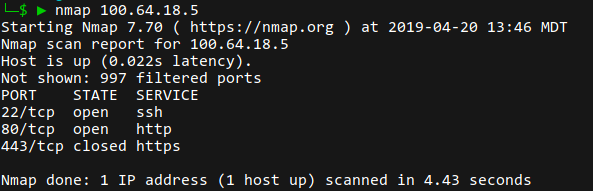

### Machines B and F (carriage and saddle):

I ran the following commands, given that ssh is port 22, http is port 80, and https is port 443.

```
# Allow all loopback traffic
iptables -A INPUT -i lo -j ACCEPT
iptables -A OUTPUT -o lo -j ACCEPT

# Stateful!
iptables -A INPUT -m conntrack --ctstate ESTABLISHED,RELATED -j ACCEPT
iptables -A OUTPUT -m conntrack --ctstate ESTABLISHED -j ACCEPT

# Ping/tracert rules
iptables -A INPUT -p icmp --icmp-type echo-request -j ACCEPT
iptables -A INPUT -p icmp --icmp-type echo-reply -j ACCEPT
iptables -A INPUT -p icmp --icmp-type time-exceeded -j ACCEPT
iptables -A INPUT -p icmp --icmp-type destination-unreachable -j ACCEPT

# Default to drop
iptables -P INPUT DROP
# No forwards
iptables -P FORWARD DROP
sysctl -w net.ipv4.ip_forward=0

# SSH Rules
iptables -A INPUT -p tcp -s 100.64.0.0/16 --dport 22 -m conntrack --ctstate NEW,ESTABLISHED -j ACCEPT
iptables -A INPUT -p tcp -s 10.21.32.0/24 --dport 22 -m conntrack --ctstate NEW,ESTABLISHED -j ACCEPT
iptables -A INPUT -p tcp -s 198.18.0.0/16 --dport 22 -m conntrack --ctstate NEW,ESTABLISHED -j ACCEPT

# Allow http/https traffic
iptables -A INPUT -p tcp --dport 80 -m conntrack --ctstate NEW,ESTABLISHED -j ACCEPT
iptables -A INPUT -p tcp --dport 443 -m conntrack --ctstate NEW,ESTABLISHED -j ACCEPT

# Save it
service iptables save
```

On saddle, I also had to add:

```
systemctl stop firewalld
systemctl disable firewalld
systemctl enable iptables
systemctl start iptables
```

After rebooting, rules were verified with `iptables -v -L` on each machine and `nmap 100.64.18.{2, 5}` run locally (outside the network).




And with proper nameservers set while VPN'd in:

### 

### Machine D (chase):

```
# Setup iptables
systemctl stop firewalld
systemctl disable firewalld
systemctl enable iptables
systemctl start iptables

# Allow all loopback traffic
iptables -A INPUT -i lo -j ACCEPT
iptables -A OUTPUT -o lo -j ACCEPT

# Stateful!
iptables -A INPUT -m conntrack --ctstate ESTABLISHED,RELATED -j ACCEPT
iptables -A OUTPUT -m conntrack --ctstate ESTABLISHED -j ACCEPT

# Ping/tracert rules
iptables -A INPUT -p icmp --icmp-type echo-request -j ACCEPT
iptables -A INPUT -p icmp --icmp-type echo-reply -j ACCEPT
iptables -A INPUT -p icmp --icmp-type time-exceeded -j ACCEPT
iptables -A INPUT -p icmp --icmp-type destination-unreachable -j ACCEPT

# Default to drop
iptables -P INPUT DROP
# No forwards
iptables -P FORWARD DROP
sysctl -w net.ipv4.ip_forward=0

# SSH Rules
iptables -A INPUT -p tcp -s 100.64.0.0/16 --dport 22 -m conntrack --ctstate NEW,ESTABLISHED -j ACCEPT
iptables -A INPUT -p tcp -s 10.21.32.0/24 --dport 22 -m conntrack --ctstate NEW,ESTABLISHED -j ACCEPT
iptables -A INPUT -p tcp -s 198.18.0.0/16 --dport 22 -m conntrack --ctstate NEW,ESTABLISHED -j ACCEPT

# Allow dns traffic
iptables -A INPUT -p tcp --dport 53 -m conntrack --ctstate NEW,ESTABLISHED -j ACCEPT
iptables -A INPUT -p udp --dport 53 -m conntrack --ctstate NEW,ESTABLISHED -j ACCEPT

# Save it
service iptables save
```


### Machine C (platen):

```
# Setup iptables
systemctl stop firewalld
systemctl disable firewalld
systemctl enable iptables
systemctl start iptables

# Allow all loopback traffic
iptables -A INPUT -i lo -j ACCEPT
iptables -A OUTPUT -o lo -j ACCEPT

# Stateful!
iptables -A INPUT -m conntrack --ctstate ESTABLISHED,RELATED -j ACCEPT
iptables -A OUTPUT -m conntrack --ctstate ESTABLISHED -j ACCEPT

# Ping/tracert rules
iptables -A INPUT -p icmp --icmp-type echo-request -j ACCEPT
iptables -A INPUT -p icmp --icmp-type echo-reply -j ACCEPT
iptables -A INPUT -p icmp --icmp-type time-exceeded -j ACCEPT
iptables -A INPUT -p icmp --icmp-type destination-unreachable -j ACCEPT

iptables -A OUTPUT -p icmp --icmp-type echo-request -j ACCEPT
iptables -A OUTPUT -p icmp --icmp-type echo-reply -j ACCEPT
iptables -A OUTPUT -p icmp --icmp-type time-exceeded -j ACCEPT
iptables -A OUTPUT -p icmp --icmp-type destination-unreachable -j ACCEPT

# Default to drop
iptables -P INPUT DROP
# Also drop outbound
iptables -P OUTPUT DROP
# No forwards
iptables -P FORWARD DROP
sysctl -w net.ipv4.ip_forward=0

# SSH Rules
iptables -A INPUT -p tcp -s 100.64.0.0/16 --dport 22 -m conntrack --ctstate NEW,ESTABLISHED -j ACCEPT
iptables -A INPUT -p tcp -s 10.21.32.0/24 --dport 22 -m conntrack --ctstate NEW,ESTABLISHED -j ACCEPT
iptables -A INPUT -p tcp -s 198.18.0.0/16 --dport 22 -m conntrack --ctstate NEW,ESTABLISHED -j ACCEPT

# Allow C to initiate ssh connections outward
iptables -A OUTPUT -p tcp --dport 22 -m conntrack --ctstate NEW,ESTABLISHED -j ACCEPT

# Allow C to query dns
iptables -A OUTPUT -p tcp --dport 53 -m conntrack --ctstate NEW,ESTABLISHED -j ACCEPT
iptables -A OUTPUT -p udp --dport 53 -m conntrack --ctstate NEW,ESTABLISHED -j ACCEPT

# Allow outward http/https traffic
iptables -A OUTPUT -p tcp --dport 80 -m conntrack --ctstate NEW,ESTABLISHED -j ACCEPT
iptables -A OUTPUT -p tcp --dport 443 -m conntrack --ctstate NEW,ESTABLISHED -j ACCEPT

# Allow outward ftp
iptables -A OUTPUT -p tcp --dport 21 -m conntrack --ctstate NEW,ESTABLISHED -j ACCEPT

# Allow inbound ftp from local(ish) network
iptables -A INPUT -p tcp -s 100.64.0.0/16 --dport 21 -m conntrack --ctstate NEW,ESTABLISHED -j ACCEPT

# Save it
service iptables save
```


### Machine E

```
# Setup iptables
systemctl stop firewalld
systemctl disable firewalld
systemctl enable iptables
systemctl start iptables

# Allow all loopback traffic
iptables -A INPUT -i lo -j ACCEPT
iptables -A OUTPUT -o lo -j ACCEPT

# Stateful!
iptables -A INPUT -m conntrack --ctstate ESTABLISHED,RELATED -j ACCEPT
iptables -A OUTPUT -m conntrack --ctstate ESTABLISHED -j ACCEPT

# Ping/tracert rules
iptables -A INPUT -p icmp --icmp-type echo-request -j ACCEPT
iptables -A INPUT -p icmp --icmp-type echo-reply -j ACCEPT
iptables -A INPUT -p icmp --icmp-type time-exceeded -j ACCEPT
iptables -A INPUT -p icmp --icmp-type destination-unreachable -j ACCEPT

# Default to drop
iptables -P INPUT DROP
# No forwards
iptables -P FORWARD DROP
sysctl -w net.ipv4.ip_forward=0

# SSH Rule
iptables -A INPUT -p tcp -s 10.21.32.0/24 --dport 22 -m conntrack --ctstate NEW,ESTABLISHED -j ACCEPT

# Allow inbound CIFS and SMB from local network
iptables -A INPUT -p tcp -s 10.21.32.0/24 --dport 135 -m conntrack --ctstate NEW,ESTABLISHED -j ACCEPT
iptables -A INPUT -p tcp -s 10.21.32.0/24 --dport 445 -m conntrack --ctstate NEW,ESTABLISHED -j ACCEPT
iptables -A INPUT -p udp -s 10.21.32.0/24 --dport 137:139 -m conntrack --ctstate NEW,ESTABLISHED -j ACCEPT

# Save it
service iptables save
```


### Machine A

```
# Allow all loopback traffic
iptables -A INPUT -i lo -j ACCEPT
iptables -A OUTPUT -o lo -j ACCEPT

# Stateful!
iptables -A INPUT -m conntrack --ctstate ESTABLISHED,RELATED -j ACCEPT
iptables -A OUTPUT -m conntrack --ctstate ESTABLISHED -j ACCEPT

# Ping/tracert rules
iptables -A INPUT -p icmp --icmp-type echo-request -j ACCEPT
iptables -A INPUT -p icmp --icmp-type echo-reply -j ACCEPT
iptables -A INPUT -p icmp --icmp-type time-exceeded -j ACCEPT
iptables -A INPUT -p icmp --icmp-type destination-unreachable -j ACCEPT

# Default to drop
iptables -P INPUT DROP
#iptables -P FORWARD DROP

# Enable http/https
iptables -A FORWARD -p tcp --dport 80 -d 100.64.18.2 -j ACCEPT
iptables -A FORWARD -p tcp --dport 443 -d 100.64.18.2 -j ACCEPT
iptables -A FORWARD -p tcp --dport 80 -d 100.64.18.5 -j ACCEPT
iptables -A FORWARD -p tcp --dport 443 -d 100.64.18.5 -j ACCEPT

# Allow dns traffic
iptables -A FORWARD -p tcp --dport 53 -d 100.64.18.4 -m conntrack --ctstate NEW,ESTABLISHED -j ACCEPT
iptables -A FORWARD -p udp --dport 53 -d 100.64.18.4 -m conntrack --ctstate NEW,ESTABLISHED -j ACCEPT


# TODO: SSH, FTP, CIFS, SMB forwarding for B/C/D/E
# TODO: Block facebook

# SSH Rules
iptables -A INPUT -p tcp -s 100.64.0.0/16 --dport 22 -m conntrack --ctstate NEW,ESTABLISHED -j ACCEPT
iptables -A INPUT -p tcp -s 10.21.32.0/24 --dport 22 -m conntrack --ctstate NEW,ESTABLISHED -j ACCEPT
iptables -A INPUT -p tcp -s 198.18.0.0/16 --dport 22 -m conntrack --ctstate NEW,ESTABLISHED -j ACCEPT
```

